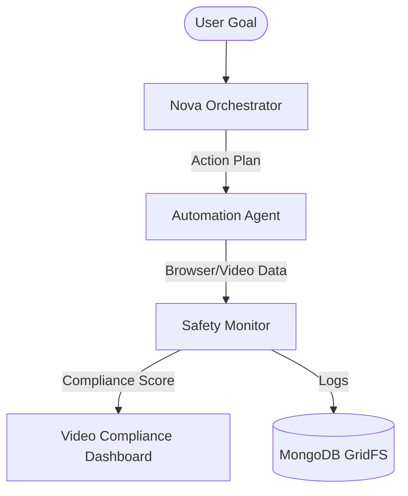

# NovaFlow: Multimodal AI Agentic Pipeline for Brand Safety & Compliance


## 1. Project Overview
**NovaFlow** is an advanced Multimodal AI Agentic Pipeline designed to automate brand safety and compliance monitoring. In the modern digital landscape, ensuring that video content and automated browser interactions adhere to regulatory and brand guidelines is a complex, high-velocity challenge. 

NovaFlow addresses this by leveraging **Amazon Nova** multimodal models to decompose high-level goals into executable steps, monitor live sessions for safety violations, and provide a real-time compliance dashboard for human oversight.

---

## 2. Key Features
-   **Goal Decomposition**: Automatically translates natural language goals into atomic, executable browser actions.
-   **Multimodal Safety Monitoring**: Real-time analysis of video frames and text for brand safety violations (nudity, violence, hate speech, etc.).
-   **Automated Session Handling**: Headless browser automation for navigating complex web workflows.
-   **Compliance Dashboard**: A premium, high-fidelity UI for monitoring active agents, viewing safety scores, and reviewing violation logs.
-   **High-Volume Storage**: Efficient ingestion of video frames and metadata into MongoDB using GridFS.

---

## 3. Tech Stack
### **Frontend**
-   **Core**: React 18, Vite
-   **Styling**: Tailwind CSS (v4), Material UI (MUI), Radix UI
-   **Interactions**: Framer Motion, Lucide Icons
-   **Charts**: Recharts

### **Backend**
-   **API Framework**: FastAPI
-   **Server**: Uvicorn
-   **Language**: Python 3.10+

### **AI & Data**
-   **LLM/LMM**: Amazon Nova (AWS Bedrock)
-   **Database**: MongoDB (with GridFS)
-   **Media Processing**: FFmpeg (Frame Extraction Pipeline)

---

## 4. System Architecture
NovaFlow operates as a three-tier agentic system:

1.  **The Orchestrator**: Receives the user goal and uses Amazon Nova to generate a step-by-step execution plan.
2.  **The Automation Agent**: Executes the plan using automated browser sessions, feeding real-time data back to the pipeline.
3.  **The Safety Agent**: A dedicated multimodal monitor that inspects visual and textual output against compliance policies.



---

## 5. Installation and Setup

### **Prerequisites**
- Python 3.10+
- Node.js 18+
- MongoDB Instance
- AWS Credentials (with access to Bedrock & Amazon Nova)

### **Backend Setup**
1. Navigate to the root directory.
2. Install Python dependencies:
   ```bash
   pip install -r backend/requirements.txt
   ```
3. Configure environment variables in a `.env` file (see `backend/aws_config.py` for reference).
4. Run the API:
   ```bash
   cd backend
   python app.py
   ```

### **Frontend Setup**
1. Navigate to the `frontend` directory.
2. Install dependencies:
   ```bash
   npm install
   ```
3. Start the development server:
   ```bash
   npm run dev
   ```

---

## 6. Usage Instructions
1. **Launch the Dashboard**: Access the Vite-powered UI at `http://localhost:5173`.
2. **Define a Goal**: Enter a target URL or goal (e.g., "Verify compliance of the promotional video at example.com/promo").
3. **Monitor Execution**: Watch the live step decomposition and compliance feedback on the dashboard.
4. **Review Results**: Visual evidence and safety logs are automatically persisted to the database.

---

## 7. Demo
*Placeholder: Visual walkthrough of the NovaFlow Dashboard and Agentic Execution.*
> [!NOTE]
> Demo recordings and screenshots will be available in the `/docs` directory.

---

## 8. Future Improvements
-   **Enhanced Multimodal Reasoning**: Integrating deeper cross-modal validation between audio and video tracks.
-   **Auto-Remediation**: Agents capable of taking corrective actions when a minor safety violation is detected.
-   **Distributed Scaling**: Scaling the frame extraction pipeline across multiple AWS Lambda instances for extreme high-volume processing.

---

## 9. About the Author
**Nirattay Biswas**  
Passionate about AI Engineering, Multimodal Systems, and Scalable Architecture.  

[](https://github.com/Nirucoder)

---

© 2026 Nirattay Biswas. All rights reserved.
